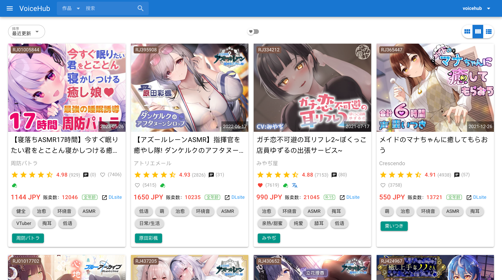

# VoiceHub

搜索、发现更多你可能喜欢的音声作品。

## 快速开始

VoiceHub支持对作品的社团、声优以及标签进行精确过滤，你可以在 [社团](https://voicehub.top/makers) / [声优](https://voicehub.top/creators) / [标签](https://voicehub.top/genres) 页通过鼠标右键菜单（移动设备请长按唤出）包含或排除对应项再搜索符合条件的作品。比如：

- [搜索社团「CANDY VOICE」或者「桃色CODE」的作品](https://voicehub.top/works?maker_ids=RG24350&maker_ids=RG10971)

- [排除社团「大家一起来翻译」以及「Whisp」的作品](https://voicehub.top/works?exclude_maker_ids=RG60289&exclude_maker_ids=RG41088)

- [搜索声优中包含「浅見ゆい」或者「陽向葵ゅか」并且不包含「秋野かえで」的作品](https://voicehub.top/works?creator_ids_or=18240&creator_ids_or=17385&exclude_creator_ids=18242)

- [搜索声优中同时包含「浅見ゆい」和「陽向葵ゅか」并且不包含「逢坂成美」的作品](https://voicehub.top/works?creator_ids_and=17385&creator_ids_and=18240&exclude_creator_ids=17394)

- [搜索声优「浅見ゆい」的单体作品，不包含其他声优](https://voicehub.top/works?creator_ids_or=18240&single=true)

- [搜索标签中同时包含「治愈」、「舔耳」和「亲热/甜蜜」并且不包含「病娇」的作品](https://voicehub.top/works?genre_ids_and=56&genre_ids_and=500&genre_ids_and=4&exclude_genre_ids=316)

通过构造URL组合查询参数，你可以实现更个性化的高级搜索，比如：

- [搜索社团为「音撫屋」，声优中包含「浅見ゆい」，标签中包含「治愈」，销量不低于3000，评分不低于4.8，收藏量不低于1000的作品](https://voicehub.top/works?maker_ids=RG20050&creator_ids_or=18240&genre_ids_and=56&min_dl_count=3000&min_rate=4.8&min_wishlist_count=1000)

## 资源托管

你只须按特定格式发送压缩包文件给电报机器人 [DLsite Bot](https://t.me/dlsite_bot) 即可将音声/字幕资源托管到VoiceHub。

**VoiceHub的资源库为私有库，你分享的内容仅自己可搜索/查看。** 如果你要与他人分享，可将机器人回复的获取指令发给Ta，对方只要发送同样的指令给 [DLsite Bot](https://t.me/dlsite_bot) 即可获得相应资源。